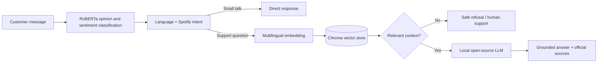

# Spotify Support RAG Chatbot

A complete, local Retrieval-Augmented Generation (RAG) customer-support chatbot customized for Spotify. The FastAPI application retrieves verified help content from a curated knowledge base, asks an open-source LLM to answer only from that context, and returns official source links with every grounded answer.

> Educational project. Spotify is a trademark of Spotify AB. This repository is not affiliated with or endorsed by Spotify.

## What is included

- **Spotify knowledge base:** 36 support topics covering onboarding, Premium benefits and regional pricing, billing, accounts, security, playback, downloads, playlists, devices, privacy, creators, podcasts, and audiobooks.
- **Semantic RAG:** ChromaDB and multilingual sentence-transformer embeddings. The index is created automatically on first startup.
- **Open-source LLM:** local `google/flan-t5-small` through Hugging Face Transformers by default. Ollama with `qwen2.5:3b` is also supported.
- **Grounding controls:** relevance threshold, explicit refusal when context is weak, deterministic generation, and official citations.
- **Transformer opinion routing:** CardiffNLP RoBERTa classifies positive, neutral, and negative sentiment before intent routing; opinions receive a conversational response without unnecessary retrieval.
- **Integrated NLP routing:** language detection, trained Spotify intent classification, small-talk/opinion bypass, and priority flags for negative/security messages.
- **Conversation context:** the API accepts recent user/assistant turns so short follow-ups such as “Why do I do that?” resolve against the preceding question.
- **FastAPI:** typed `/chat` and `/health` endpoints plus interactive OpenAPI docs at `/docs`.
- **Responsive UI:** Spotify-inspired desktop/mobile chat, suggested questions, status metadata, typing feedback, and clickable sources.
- **Tests and Docker:** deterministic tests use TF-IDF retrieval and an extractive generator so CI does not download models.

## Architecture



The committed JSON file is the source of truth. On startup, `SpotifyRetriever` embeds and upserts every entry into Chroma. A query retrieves the nearest support chunks; low-scoring chunks are discarded before the prompt reaches the generator. If Chroma or its embedding model cannot initialize, the app reports the issue and falls back to local TF-IDF retrieval.

## Quick start

Python 3.10 or newer is recommended.

```bash
git clone <your-new-repository-url>
cd <repository-folder>
python -m venv .venv
```

Activate the environment:

```powershell
# Windows PowerShell
.venv\Scripts\Activate.ps1
```

```bash
# macOS/Linux
source .venv/bin/activate
```

Install and run:

```bash
pip install -r requirements.txt
uvicorn app:app --reload
```

Open <http://127.0.0.1:8000>. The first run downloads the sentiment, embedding, and FLAN-T5 models, then builds `chroma_db/`. Later runs reuse the local caches and persistent index.

No API key is required.

To execute all four training/exploration notebooks, install the additional notebook dependencies:

```bash
pip install -r requirements-notebooks.txt
```

## Stronger local LLM with Ollama

FLAN-T5 Small keeps setup light enough for a classroom machine. For higher-quality conversational answers, install [Ollama](https://ollama.com/), then run:

```bash
ollama pull qwen2.5:3b
```

Copy `.env.example` to `.env` or set these environment variables before starting FastAPI:

```env
LLM_BACKEND=ollama
OLLAMA_MODEL=qwen2.5:3b
OLLAMA_URL=http://localhost:11434
```

PowerShell example:

```powershell
$env:LLM_BACKEND="ollama"
$env:OLLAMA_MODEL="qwen2.5:3b"
uvicorn app:app --reload
```

## API

### `POST /chat`

Request:

```json
{
  "message": "How many songs can I download for offline listening?",
  "top_k": 4
}
```

Response fields include `response`, `language`, `sentiment`, `intent`, `escalated`, `grounded`, and `sources`.

### `GET /health`

Reports the knowledge-entry count, retrieval backend, LLM backend, and whether the local model loaded successfully.

## Tests

```bash
pytest -q
python scripts/evaluate_100_queries.py
```

Tests intentionally set `RAG_RETRIEVAL_BACKEND=tfidf` and `LLM_BACKEND=extractive`. This verifies routing, retrieval, citations, refusal behavior, and the FastAPI contract without network access or multi-gigabyte model downloads.

The 100-query evaluation is a separate adversarial regression set. Its prompts were written independently from the knowledge-base examples and include shorthand, misspellings, emotional billing requests, vague follow-ups, and topic switches. This prevents a misleading score based on replaying the same questions used to build the index.

## Project structure

```text
app.py                         FastAPI application
spotify_rag/
  assistant.py                 End-to-end orchestration
  config.py                    Environment configuration
  llm.py                       Transformers, Ollama, and safe fallback generators
  nlp.py                       Language, sentiment, and intent routing
  retrieval.py                 Chroma semantic retrieval and TF-IDF fallback
data/spotify_knowledge_base.json
static/index.html              Responsive chatbot UI
tests/                         Unit and API tests
scripts/evaluate_100_queries.py Independent human-style support evaluation
1_language_detection.ipynb     Assignment language-model notebook
2_sentiment_classifier.ipynb   Assignment sentiment-model notebook
3_intent_classifier.ipynb      Intent-model training notebook
4_rag_pipeline.ipynb           RAG exploration notebook
```

## Updating the knowledge base

Edit `data/spotify_knowledge_base.json`. Each entry needs a unique `id`, `category`, `title`, example `questions`, a concise `answer`, and an official `source_url`. Restart the app after editing. Existing entries are updated and entries removed from JSON are removed from Chroma.

Avoid storing plan prices or region-specific availability unless you also add a review process, because those facts change often. The knowledge base records its last review date at the top of the file.

## Design decisions

- Retrieval and generation are separate modules so each can be explained, tested, or replaced independently.
- The app starts without running notebooks; notebooks remain as reproducible training and exploration deliverables.
- Negative sentiment and account-security messages receive a priority flag while still returning useful grounded steps.
- The model never receives weak retrieval results. This reduces hallucinations more reliably than prompt wording alone.
- Sources are part of the API response rather than text invented by the LLM.
